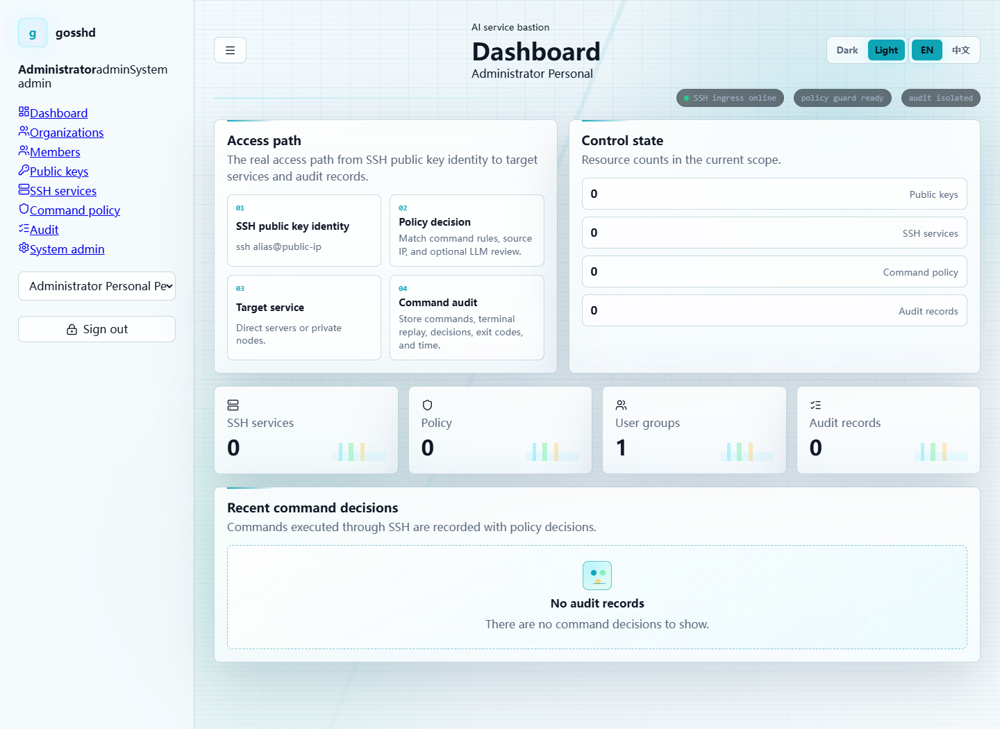
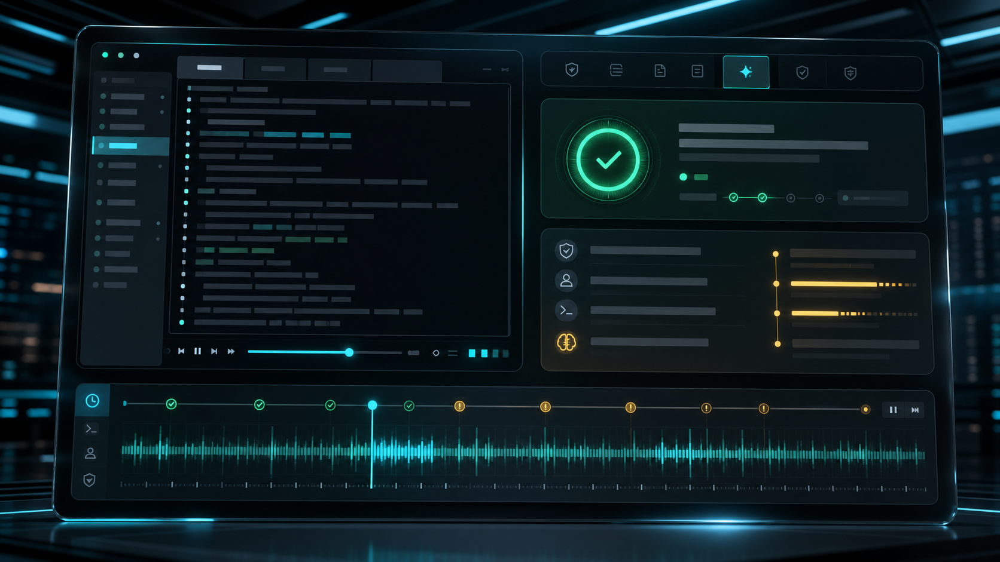

# GOSSHD Bastion

[English](README.md) | [简体中文](README.zh-CN.md)

**GOSSHD Bastion is an AI service bastion:** a single Go server that gives operators, automation, and AI agents native SSH access with alias routing, command policy, LLM review, audit search, and terminal replay.


## Why It Exists

AI tools can inspect machines, restart services, read logs, and chain commands faster than a human can watch a terminal. Giving those tools a raw SSH key is too much trust; putting every command behind a human approval queue is too slow.

GOSSHD Bastion sits between AI work and private infrastructure:

- SSH still feels like SSH: `ssh inference-gpu@bastion.example.com`.
- Public keys identify platform users; SSH usernames resolve target aliases.
- Targets can be direct SSH servers or private nodes enrolled from behind NAT.
- Command safety groups apply whitelist, blacklist, source IP, user group, target tag, and capability rules.
- Unmatched commands can be reviewed by an OpenAI-compatible LLM.
- Exec decisions and interactive terminal sessions are written to audit storage, with compressed replay data for terminal review.

## Product Preview



The embedded console manages organizations, members, user groups, public keys, SSH services, colored tags, private-node installation, safety policies, LLM configs, prompts, audit search, and terminal replay.



## Core Capabilities

- **Alias-native SSH:** users connect through the bastion with `ssh alias@public-ip`.
- **SQLite control plane:** users, orgs, sessions, groups, keys, targets, tags, policies, prompts, and LLM configs are persisted locally.
- **Separate audit database:** command audit data is isolated from the main control database.
- **Private nodes:** Linux/macOS and Windows install commands include enrollment tokens; startup mode uses systemd on Linux and `sc.exe` on Windows.
- **Command safety groups:** blacklist, whitelist, LLM fallback, IP allowlists, target/tag binding, user-group binding, interactive terminal, port forwarding, upload, and download controls.
- **LLM review:** OpenAI-compatible chat completions with fail-closed behavior; allowed responses can omit a reason.
- **Terminal replay:** interactive shell sessions can be recorded as compressed timestamped files and replayed from the console.
- **Admin console:** system admins keep normal user menus and get system settings, account management, organization repair, DingTalk settings, and LDAP connection settings.
- **MCP endpoint:** `/mcp` exposes control-plane operations to AI tools.

## Quick Start

Download the latest server package from [GitHub Releases](https://github.com/qinyongliang/gosshd-bastion/releases/latest), then run:

```sh
./gosshd-server \
  --http-listen :18080 \
  --ssh-listen :22022 \
  --database-path ./data/gosshd.db \
  --audit-database-path ./data/gosshd-audit.db \
  --host-key-path ./data/gosshd_host_key \
  --agent-cache-path ./agent-cache \
  --public-host bastion.example.com:18080 \
  --bootstrap-admin-password 'change-me'
```

Open `http://bastion.example.com:18080/` and sign in:

```text
email: admin
password: change-me
```

Then:

1. Add your SSH public key.
2. Create or select an organization.
3. Add a direct SSH server or create a private-node enrollment.
4. Add command safety groups and optional LLM review.
5. Connect through the bastion:

```sh
ssh -p 22022 inference-gpu@bastion.example.com hostname
```

## Private Node Install

Create a private-node enrollment from **SSH services -> Add service -> Private node**. The console gives tokenized commands.

Run once:

```sh
curl -fsSL http://bastion.example.com:18080/install/<token>.sh | sh
```

```powershell
irm http://bastion.example.com:18080/install/<token>.ps1 | iex
```

Install as a startup service:

```sh
curl -fsSL http://bastion.example.com:18080/install/<token>.sh | sudo sh -s -- install
```

```powershell
$s='http://bastion.example.com:18080/install/<token>.ps1'
irm $s -OutFile $env:TEMP\gosshd-agent-install.ps1
powershell -ExecutionPolicy Bypass -File $env:TEMP\gosshd-agent-install.ps1 -Install
```

Once registered, a private node is just another SSH service: rename it, tag it, bind policies to it, and audit it like a manually added target.

## Command Review Model

Policy evaluation is intentionally predictable:

1. Source IP and capability gates are checked.
2. Blacklist rules deny matching commands.
3. Whitelist rules allow matching commands.
4. If no rule matches and an LLM is configured, the command is sent to the model.
5. If there is no valid decision, the request fails closed or uses the configured default action.

LLM responses use JSON:

```json
{"allow": true}
```

```json
{"allow": false, "reason": "Command modifies production data without an approved maintenance window."}
```

## Documentation And Website

The GitHub Pages source lives in [`site/`](site/). It includes the promotional homepage, docs page, generated visual assets, and the xterm-style replay demo used on the public website.

## Development

```sh
go test ./...
go build ./cmd/gosshd-server ./cmd/gosshd-agent
```

Browser E2E requires explicit Node, Playwright, and Chrome paths:

```powershell
$env:GOPROXY='https://goproxy.cn,direct'
$env:GOSSHD_UI_E2E_NODE='C:\path\to\node.exe'
$env:GOSSHD_UI_E2E_PLAYWRIGHT='C:\path\to\playwright'
$env:GOSSHD_UI_E2E_BROWSER='C:\path\to\chrome.exe'
go test ./internal/server -run TestUIE2EWithBrowser -v
```

## Release Shape

Releases publish cross-platform server archives, standalone private-node binaries, and checksums. This version does not publish a `full` package.
